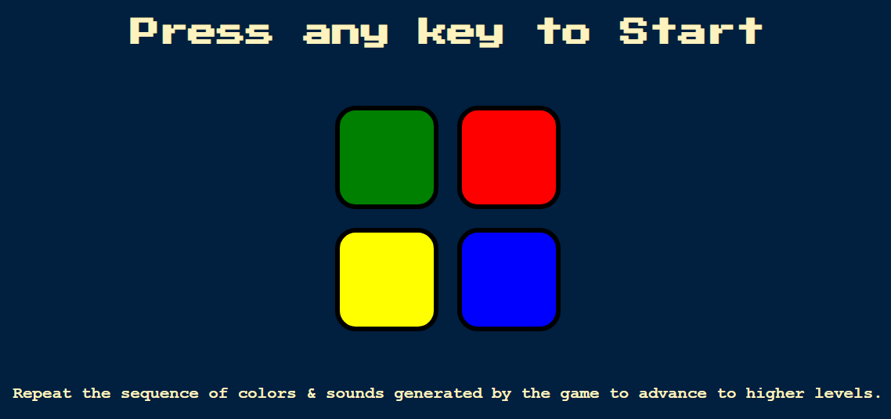

# Simon Game

## Description

The Simon Game is a classic memory game where players need to repeat a sequence of colors and sounds generated by the game. It's a fun and challenging way to test your memory and reflexes!

## Features

- Random sequence generation of colors and sounds.
- Interactive gameplay where players need to repeat the sequence.
- Increasing difficulty levels as players progress.
- Audio feedback for correct and incorrect inputs.

## How to Play ?

To play the Simon Game, simply checkout the deployed website under "About" section.

## Screenshot

## Usage

- Press any key to start the game.
- Watch and listen carefully to the sequence played by the game.
- Click on the buttons to repeat the sequence.
- Try to reach as high a level as possible to achieve a high score.

## Contributing

Contributions are welcome! If you'd like to contribute to the project, please follow these steps:

1. Fork the repository
2. Create your feature branch (`git checkout -b feature/YourFeature`)
3. Commit your changes (`git commit -am 'Add some feature'`)
4. Push to the branch (`git push origin feature/YourFeature`)
5. Create a new Pull Request

## Credits

This project was created as part of a [Web-Development Course](https://www.udemy.com/course/the-complete-web-development-bootcamp/) on Udemy. Credits go to Dr. Angela Yu for providing guidance and resources.
